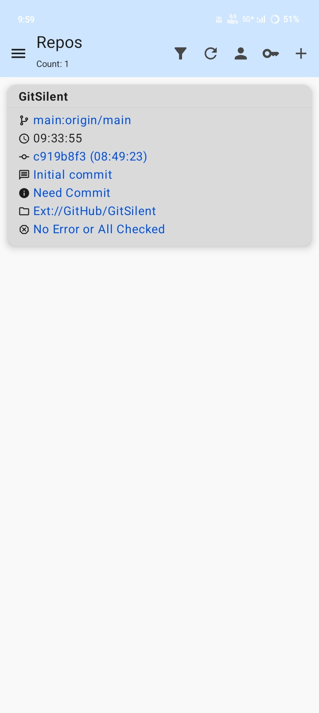
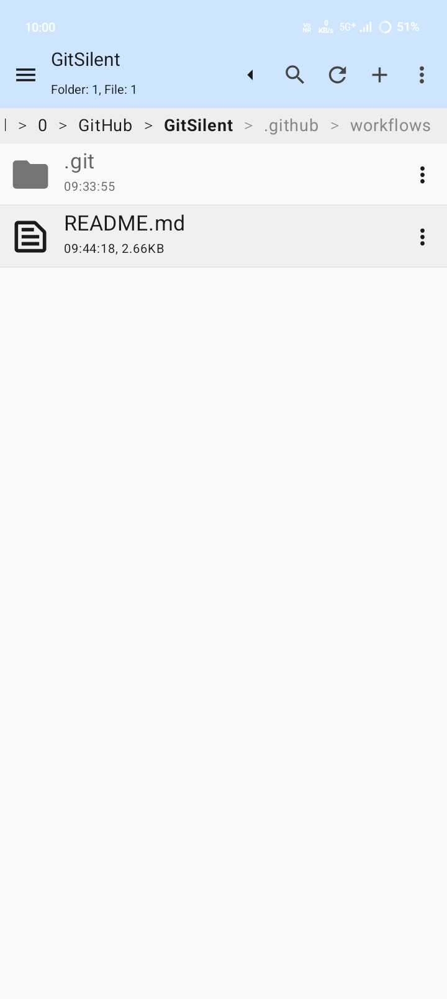
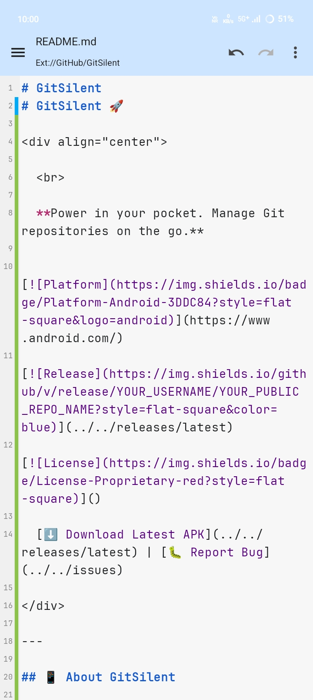
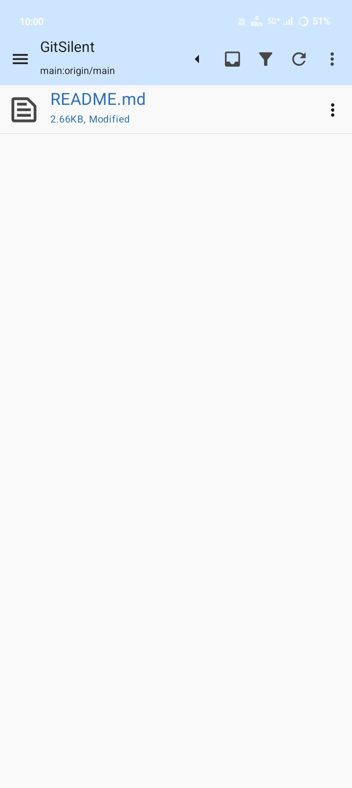
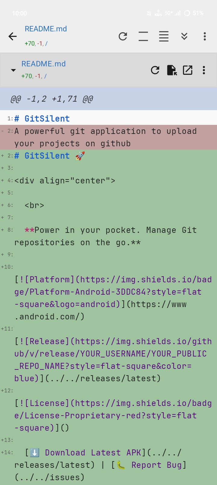
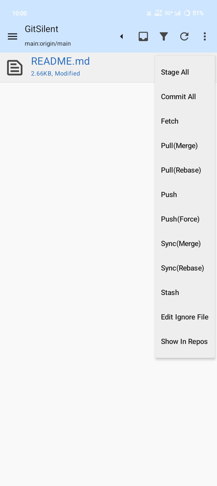
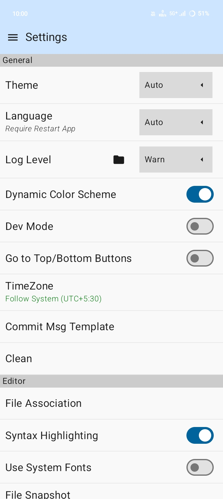
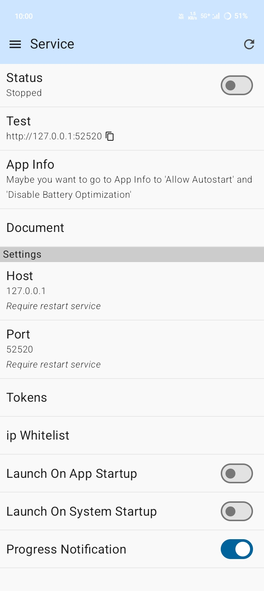
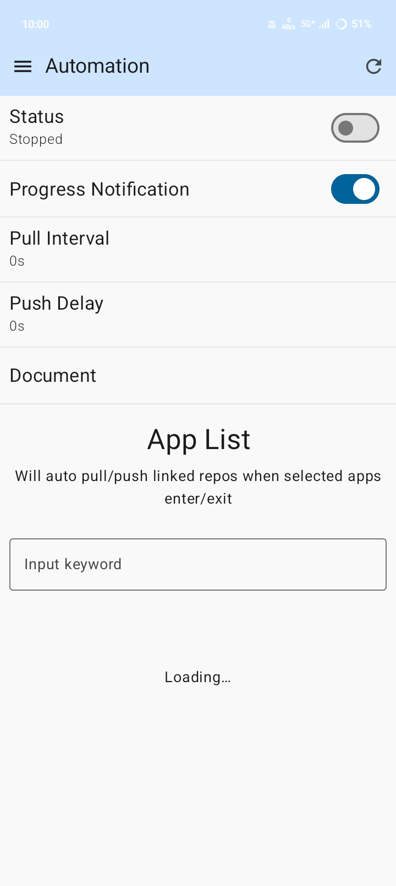
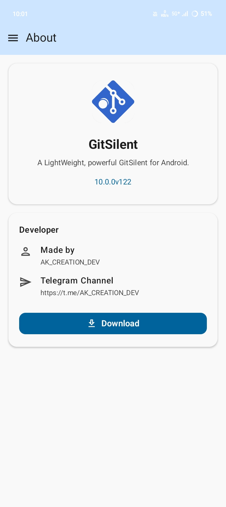

# GitSilent 🚀

  
   
   
  
  **Power in your pocket. Manage Git repositories on the go.**
  
  
  
  

  [⬇️ Download Latest APK](https://github.com/AKCREATIONDEV/GitSilent/releases/latest) | [🐛 Report Bug](https://github.com/AKCREATIONDEV/GitSilent/issues)

---

## 📱 About GitSilent

**GitSilent** is a powerful Android Git client designed to let you fully manage Git repositories directly on your phone. Whether you are fixing a bug on the commute or reviewing code away from your desk, GitSilent provides a reliable and feature-rich environment.

The app is lightweight, built on modern **Material 3** design principles, and offers a robust Git GUI. It comes equipped with essential developer tools like a crash handler, changelog viewer, and background sync capabilities.

---

## ✨ Key Features

GitSilent brings desktop-class Git performance to Android:

* **🛠️ Complete Git Operations:** Seamlessly clone, commit, push, and pull repositories.
* **🌿 Branch Management:** Create, delete, and merge branches with ease.
* **📝 Built-in Code Editor:** Edit files directly with syntax highlighting support.
* **🔐 Secure Authentication:** Full support for SSH keys and HTTPS authentication.
* **👀 Diff Viewer:** Visualize changes before you commit.
* **🎨 Material 3 Design:** A beautiful, modern, and intuitive user interface.
* **⚡ Developer Tools:** Includes automation tasks, background sync, and detailed logs.

---

## 📸 Screenshots

### App Interface & Editor
| Repository List | File Browser | Code Editor |
|:---:|:---:|:---:|
|  |  |  |

| Change List | Diff Viewer | Empty File View |
|:---:|:---:|:---:|
|  |  |  |

### Settings & Tools
| Settings | Service/Server | Automation | About Screen |
|:---:|:---:|:---:|:---:|
|  |  |  |  |

---

## 📥 How to Install

1.  Go to the **[Releases](https://github.com/AKCREATIONDEV/GitSilent/releases/latest)** page.
2.  Download the latest `.apk` file.
3.  Open the file on your Android device.
4.  If prompted, allow installation from **"Unknown Sources"**.
5.  Launch **GitSilent** and start coding!

---

## 🔒 Permissions

GitSilent respects your privacy and only requests necessary permissions:
* **Storage:** To clone and manage repositories on your device.
* **Internet:** To sync with remote repositories (GitHub, GitLab, Bitbucket, etc.).

---

  Built with ❤️ by <a href="https://github.com/AKCREATIONDEV">AK_CREATION_DEV</a>

